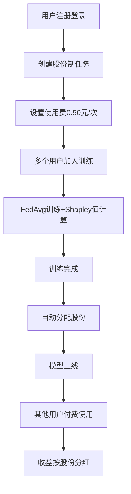
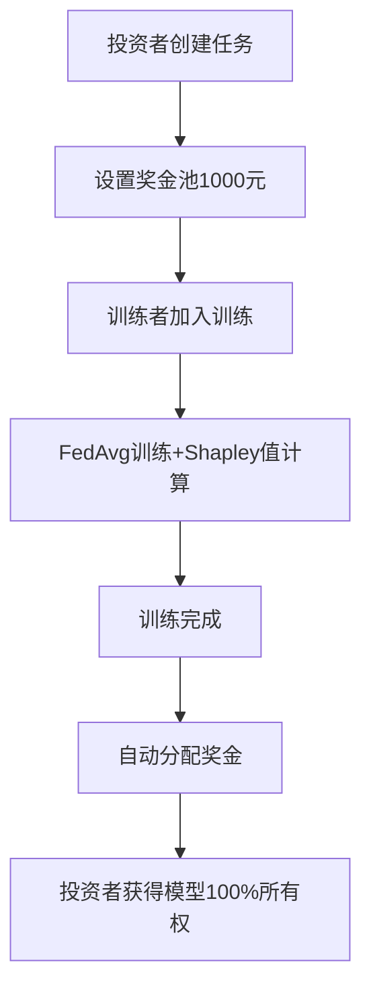

# BlockFed - 联邦学习股份和支付系统

## 🚀 项目简介

这是一个完整的联邦学习平台，集成了用户认证、模型训练、股份管理和收益分配功能。

### ✨ 核心功能

- **用户系统**：注册、登录、个人资产管理
- **两种支付模式**：
  - 💰 **奖金池模式**：投资者设置奖金池，训练完成后按贡献分配
  - 💎 **股份制模式**：训练者按贡献获得股份，模型使用费按股份分红
- **联邦学习**：FedAvg算法 + Shapley值贡献度计算
- **模型预测**：付费使用训练完成的模型
- **收益分配**：自动按股份比例分配收益
- **资产管理**：账户余额、虚拟币、数据块管理

---

## 📦 环境准备

### 1. 安装Python依赖

```bash
# 进入项目目录
cd C:\Users\wangboyu\Desktop\BlockFednew

# 安装依赖
pip install -r requirements.txt

# 如果缺少Pillow（图像预测功能需要）
pip install Pillow
```

### 2. 数据库初始化

**⚠️ 重要：由于修改了核心模型，需要重新创建数据库**

```bash
# 删除旧数据库（如果存在）
rm db.sqlite3

# 删除旧迁移文件
rm -rf federation_app/migrations/0*.py

# 创建新迁移
python manage.py makemigrations

# 执行迁移
python manage.py migrate
```

### 3. 创建超级管理员（可选）

```bash
python manage.py createsuperuser
# 按提示输入用户名、邮箱和密码
```

### 4. 启动服务器

```bash
python manage.py runserver
```

服务器将在 `http://127.0.0.1:8000/` 启动

---

## 🎯 使用指南

### 访问地址

- **登录/注册页面**: http://127.0.0.1:8000/login/
- **主控制台**: http://127.0.0.1:8000/
- **个人中心**: http://127.0.0.1:8000/profile/
- **模型预测**: http://127.0.0.1:8000/predict/
- **后台管理**: http://127.0.0.1:8000/admin/

### 快速开始

#### Step 1: 注册用户

访问 http://127.0.0.1:8000/login/ 注册账户：
- 用户名：`user1`
- 密码：`password123`
- 邮箱（可选）

注册成功后会自动登录并获得：
- 余额：¥0.00
- 虚拟币：100

#### Step 2: 充值（模拟）

在个人中心点击"充值"按钮，输入金额（如500），模拟充值成功。

#### Step 3: 创建任务

在主控制台创建联邦任务：

**股份制模式示例**：
```json
{
  "task_id": "task_001",
  "task_name": "CIFAR10分类任务",
  "description": "股份制模式，训练者按贡献获得股份",
  "model_architecture": "r8",
  "dataset": "CIFAR10",
  "epochs": 100,
  "payment_mode": "shareholding",
  "usage_fee_per_request": 0.50,
  "reward_pool": 0
}
```

**奖金池模式示例**：
```json
{
  "task_id": "task_002",
  "task_name": "MNIST分类任务",
  "description": "奖金池模式，训练完成后分配奖金",
  "model_architecture": "CNN",
  "dataset": "MNIST",
  "epochs": 50,
  "payment_mode": "reward",
  "usage_fee_per_request": 0.00,
  "reward_pool": 1000.00
}
```

#### Step 4: 加入任务

在任务列表中点击"加入训练"，系统会自动：
- 将你添加到任务参与者列表
- 分配数据块给你
- 当参与者≥2人时自动开始训练

#### Step 5: 等待训练完成

训练过程中可以实时查看：
- 当前轮次进度
- 全局准确度曲线
- 系统日志

#### Step 6: 查看收益

训练完成后：
- **股份制模式**：在个人中心查看持有股份比例
- **奖金池模式**：在个人中心查看奖金分配记录

#### Step 7: 使用模型

访问 http://127.0.0.1:8000/predict/：
- 选择已完成的模型
- 上传图片
- 点击"开始预测"
- 系统自动扣费并分红给股东

---

## 📊 核心业务流程

### 股份制模式流程



### 奖金池模式流程



---

## 🔧 核心API列表

### 用户认证API

```bash
# 注册
POST /api/auth/register/
{
  "username": "user1",
  "password": "password123",
  "email": "user1@example.com"
}

# 登录
POST /api/auth/login/
{
  "username": "user1",
  "password": "password123"
}

# 登出
POST /api/auth/logout/

# 充值（模拟）
POST /api/auth/recharge/
{
  "amount": 500.00
}
```

### 任务管理API

```bash
# 创建任务
POST /api/tasks/create/
{
  "task_id": "task_001",
  "task_name": "CIFAR10任务",
  "model_architecture": "r8",
  "dataset": "CIFAR10",
  "epochs": 100,
  "payment_mode": "shareholding",
  "usage_fee_per_request": 0.50,
  "reward_pool": 0
}

# 加入任务
POST /api/tasks/join/
{
  "task_id": "task_001"
}

# 退出任务
POST /api/tasks/leave/
{
  "task_id": "task_001"
}

# 获取任务状态
GET /api/tasks/{task_id}/status/
```

### 用户资产API

```bash
# 获取用户资产概览
GET /api/user/assets/

# 获取持有股份
GET /api/user/shareholdings/

# 获取参与任务
GET /api/user/participations/

# 获取收益记录
GET /api/user/revenues/
```

### 模型预测API

```bash
# 使用模型预测（自动扣费+分红）
POST /api/predict/
FormData:
  - image: 图片文件
  - task_id: 任务ID
```

---

## 📁 项目结构

```
BlockFednew/
├── federation_app/                 # Django应用
│   ├── models.py                  # 数据模型（User, FederationTask, ModelShareholding等）
│   ├── views.py                   # 主视图（任务管理、模型预测等）
│   ├── auth_views.py              # 用户认证视图
│   ├── asset_views.py             # 用户资产视图
│   ├── business_logic.py          # 核心业务逻辑（股份分配、收益分配）
│   ├── services.py                # 任务管理服务
│   ├── tasks.py                   # 联邦学习任务类
│   ├── urls.py                    # URL路由
│   ├── templates/                 # HTML模板
│   │   ├── login.html            # 登录注册页面
│   │   ├── profile.html          # 个人中心页面
│   │   ├── dashboard.html        # 主控制台
│   │   └── predict.html          # 模型预测页面
│   └── migrations/                # 数据库迁移文件
├── federation_core/               # 联邦学习核心算法
│   ├── algorithm.py              # FedAvg、Shapley值计算
│   ├── handle.py                 # 数据和模型管理
│   ├── client_manager.py         # 客户端管理
│   ├── contribution_manager.py   # 贡献度管理
│   ├── train.py                  # 本地训练
│   ├── test.py                   # 模型测试
│   ├── model_predict.py          # 模型预测
│   └── models/ResNet8.py         # ResNet8模型
├── federation_platform/          # Django项目配置
│   ├── settings.py              # 项目设置
│   └── urls.py                  # 主URL配置
├── static/                       # 静态文件
│   └── css/style.css            # 样式表
├── db.sqlite3                   # 数据库
├── manage.py                    # Django管理脚本
└── requirements.txt             # Python依赖

```

---

## 🗃️ 数据库模型

### 核心表结构

1. **User（用户表）**
   - username, password, email
   - balance（账户余额）
   - virtual_coins（虚拟币）

2. **FederationTask（联邦任务表）**
   - task_id, task_name, description
   - payment_mode（支付模式：reward/shareholding）
   - usage_fee_per_request（单次使用费）
   - reward_pool（奖金池）
   - model_status（模型状态：training/online/offline）
   - total_revenue（累计收益）

3. **ModelShareholding（模型股份表）**
   - task, user
   - share_ratio（股份占比0-1）
   - initial_contribution（初始Shapley值贡献）

4. **ModelUsageRecord（模型使用记录）**
   - task, user, usage_fee
   - prediction_result（预测结果）

5. **RevenueDistribution（收益分配记录）**
   - task, shareholder
   - revenue_amount（收益金额）
   - source_usage（来源使用记录）

6. **RewardDistribution（奖金分配记录）**
   - task, user
   - contribution_ratio（贡献占比）
   - reward_amount（奖金金额）

---

## ⚙️ 关键配置

### 支付模式选择

在创建任务时通过 `payment_mode` 字段选择：

- **`shareholding`**（股份制模式）：
  - 训练者按贡献获得股份
  - 设置 `usage_fee_per_request > 0`
  - `reward_pool` 设为0
  - 模型上线后接受付费使用
  - 使用费自动分红给股东

- **`reward`**（奖金池模式）：
  - 投资者设置奖金池
  - 设置 `reward_pool > 0`
  - 训练完成后一次性分配奖金
  - 模型下线，不接受付费使用

### Shapley值计算

在 `federation_core/algorithm.py` 中的 `calculate_shapley_values` 函数：
- 基于排列的经典Shapley值方法
- 每隔一定轮次（默认evaluation_interval）计算一次
- 记录到 `contribution_manager` 中
- 任务完成时取最终累计贡献度分配股份/奖金

---

## 🔍 常见问题

### Q1: 如何重置数据库？

```bash
rm db.sqlite3
rm -rf federation_app/migrations/0*.py
python manage.py makemigrations
python manage.py migrate
```

### Q2: 如何查看股份分配结果？

在个人中心（/profile/）查看"持有的模型股份"板块。

### Q3: 模型使用费如何分配？

股份制模式下：
- 使用者支付0.50元
- 系统自动查询该模型的所有股东
- 按股份比例分红到各股东账户
- 创建 `RevenueDistribution` 和 `Transaction` 记录

### Q4: 如何购买数据块？

在个人中心使用虚拟币购买：
```bash
POST /api/auth/purchase-data/
{
  "data_block_ids": [1, 2, 3]
}
```
每个数据块消耗10虚拟币。

---

## 📝 开发说明

### 添加新的支付模式

1. 在 `models.py` 的 `PAYMENT_MODES` 中添加新选项
2. 在 `business_logic.py` 中实现分配逻辑
3. 在 `tasks.py` 的 `_distribute_rewards_or_shares` 中添加判断分支

### 修改Shapley值计算逻辑

编辑 `federation_core/algorithm.py` 中的 `calculate_shapley_values` 函数。

### 自定义模型架构

在 `federation_core/models/` 中添加新模型，并在 `handle.py` 中注册。

---

## 📄 许可证

本项目仅用于学术作业，不涉及任何真实交易。

---

## 🎉 完成！

现在你的联邦学习股份和支付系统已经完全配置好了！

**关键功能检查清单**：
- ✅ 用户注册登录
- ✅ 两种支付模式（奖金池/股份制）
- ✅ 联邦学习训练
- ✅ Shapley值贡献度计算
- ✅ 自动股份/奖金分配
- ✅ 模型付费使用
- ✅ 收益自动分红
- ✅ 个人资产管理
- ✅ 数据块管理

**下一步**：
1. 启动服务器：`python manage.py runserver`
2. 访问 http://127.0.0.1:8000/login/ 注册用户
3. 创建任务并开始训练
4. 体验完整的股份和支付流程！
